# Perguntas questionário

## Introdução

O questionário é uma das tecnicas mais utilizadas para a elicitação de requisitos. Esta tecnica se sai muito bem perante publicos de diversos tamanhos, pois, ela consegue abordar todos os perfis de usuário de uma forma metódica e rápida. Este artefato tem como objetivo relatar como foi a experiência do questionário e elicitar os requisitos provindos desta tecnica.

## Metodologia

O questionário contou com 18 perguntas que contaram com a escala de likert, sendo destas 5 pessoais e as outras 13 relativas ao aplicativo [MOJ-Naquadah](https://moj.naquadah.com.br/cgi-bin/index.sh). As perguntas foram elaboradas com base nas [Heurísticas de nielsen](https://brasil.uxdesign.cc/10-heur%C3%ADsticas-de-nielsen-para-o-design-de-interface-58d782821840) afim de melhorar a interface gráfica do aplicativo e por consequencia a interação do mesmo com o usuário.

O questionário foi elaborado buscando somente respostas de pessoas que já tenham utilizado o aplicativo. Por isso, a primeira questão delimitava se iria para a página de envio (não utilizou) ou para as páginas com as outras perguntas (sim utilizou).

O mesmo ficou aberto do dia 17/09/23 a 21/09/23 e foi distríbuido em grupos de whatsapp e telegram da FGA.

Por fim, foi feita uma analise de dados para saber se o questionário era de fato válido.

## Perguntas
As imagens a seguir abordam as perguntas e os resultados das mesmas no questionário. 

### Perguntas gerais
As imagens de 1 à 5 evidenciam as perguntas de cunho geral efetuadas no questionário.

##### Pergunta 1
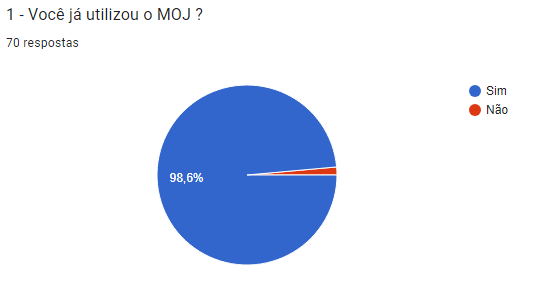

 Imagem 1: Primeira pergunta, 2023.

##### Pergunta 2
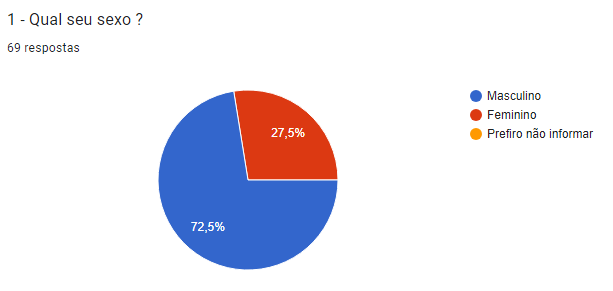

 Imagem 1: Segunda pergunta, 2023.

##### Pergunta 3
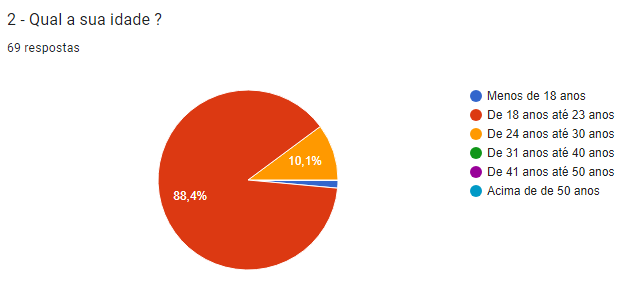

 Imagem 3: Terceira pergunta, 2023.

##### Pergunta 4
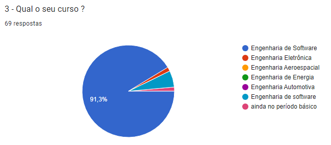

 Imagem 4: Quarta pergunta, 2023.

##### Pergunta 5
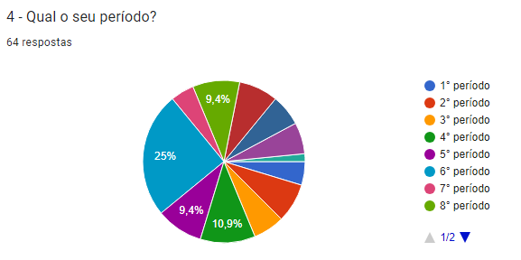

 Imagem 5: Quinta pergunta, 2023.

### Heuristica 1 - Visibilidade do status do sistema
As imagens 6 e 7 evidenciam as perguntas relacionadas a primeira heurística de Nielsen.

##### Pergunta 1
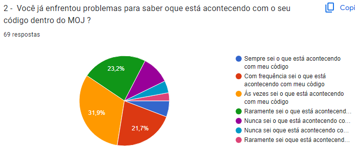

 Imagem 6: Sexta pergunta, 2023.

##### Pergunta 2
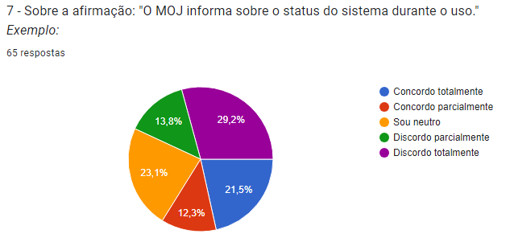

 Imagem 7: Sétima pergunta, 2023.

### Heuristica 5 - Prevenção de erros
As imagens 8 e 9 evidenciam as perguntas relacionadas a quinta heurística de Nielsen.

##### Pergunta 1
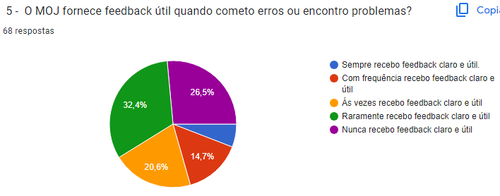

 Imagem 8: Oitava pergunta, 2023.

##### Pergunta 2
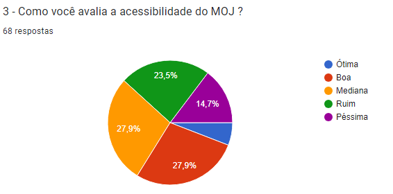

 Imagem 9: Nona pergunta, 2023.

### Heuristica 8 - Estética e design minimalista
As imagens 10 à 12 evidenciam as perguntas relacionadas a oitava heurística de Nielsen.

##### Pergunta 1
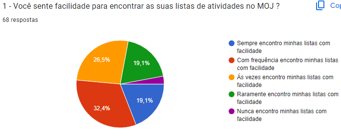

 Imagem 10: Décima pergunta, 2023.

##### Pergunta 2
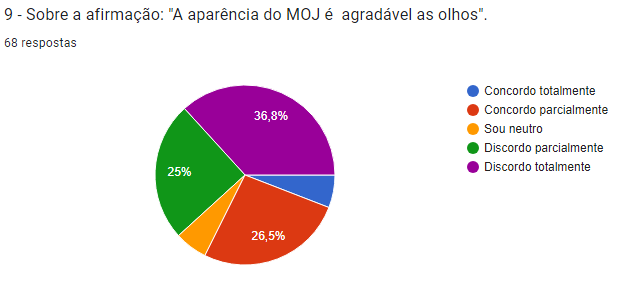

 Imagem 11: Décima primeira pergunta, 2023.

##### Pergunta 3
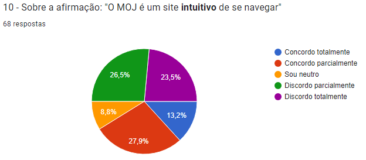

 Imagem 12: Décima segunda pergunta, 2023.

### Heuristica 9 - Diagnosticar e recuperar erros
As imagens 13 e 14 evidenciam as perguntas relacionadas a nona heurística de Nielsen.

##### Pergunta 1
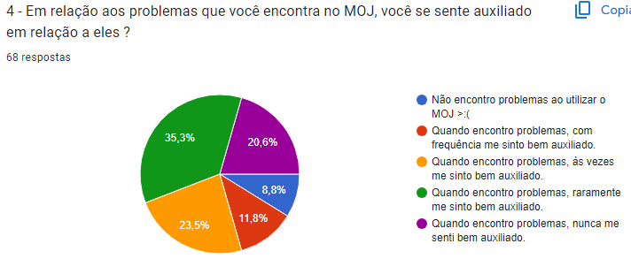

 Imagem 13: Décima Terceira pergunta, 2023.

##### Pergunta 2
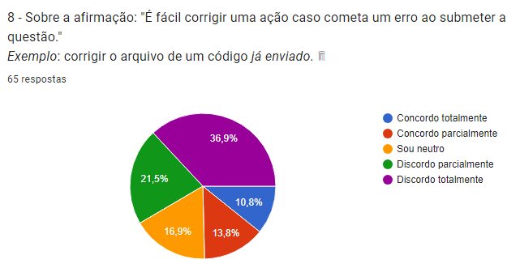

 Imagem 14: Décima quarta pergunta, 2023.

### Heuristica 10 - Ajuda e documentação
As imagens 15 á 17 evidenciam as perguntas relacionadas a décima heurística de Nielsen.

##### Pergunta 1
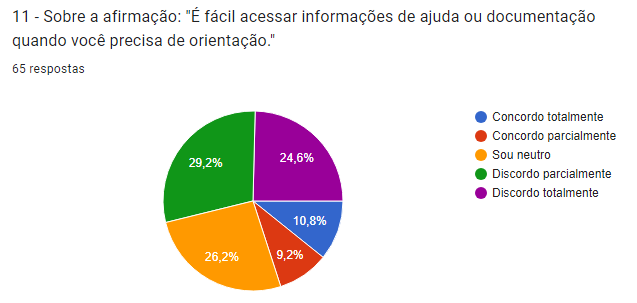

 Imagem 15: Décima Quinta pergunta, 2023.

##### Pergunta 2
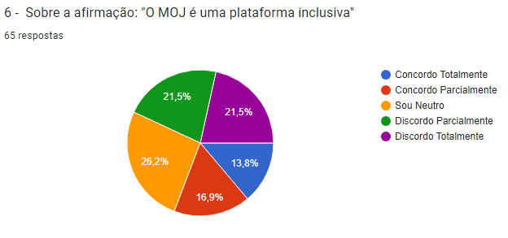

 Imagem 16: Décima Sexta pergunta, 2023.

##### Pergunta 3
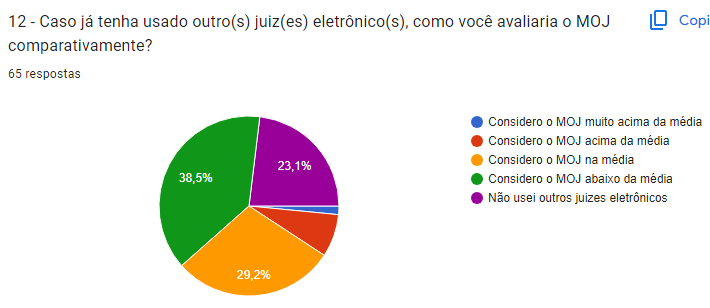

 Imagem 17: Décima Sétima pergunta, 2023.

## Bibliografia

> [1] Barbosa, S. D. J.; Silva, B. S. da; Interação Humano-Computador.
>
> [2] Questionário - Simplenote. Github.io. Disponível em: <https://requisitos-de-software.github.io/2023.1-Simplenote/elicitacao/questionario/>. Acesso em: 22 set. 2023.
>
> [3] MOMA, Gabriel. 10 heurísticas de Nielsen para o design de interface. Medium. Disponível em: <https://brasil.uxdesign.cc/10-heur%C3%ADsticas-de-nielsen-para-o-design-de-interface-58d782821840>. Acesso em: 22 set. 2023.
>
> [4] DOS, Contribuidores. Alfa de Cronbach. Wikipedia.org. Disponível em: <https://pt.wikipedia.org/wiki/Alfa_de_Cronbach>. Acesso em: 22 set. 2023.
>
> [5] DOS, Contribuidores. Coeficiente de correlação de Pearson. Wikipedia.org. Disponível em: <https://pt.wikipedia.org/wiki/Coeficiente_de_correla%C3%A7%C3%A3o_de_Pearson>. Acesso em: 22 set. 2023.

## Histórico de versão

| Versão | Data       | Descrição             | Autor | Revisor |
| ------ | ---------- | --------------------- | ----- | ------- |
| `1.1`  | 26/10/2023 | Criação do documento  | Kauã  | Ana     |

